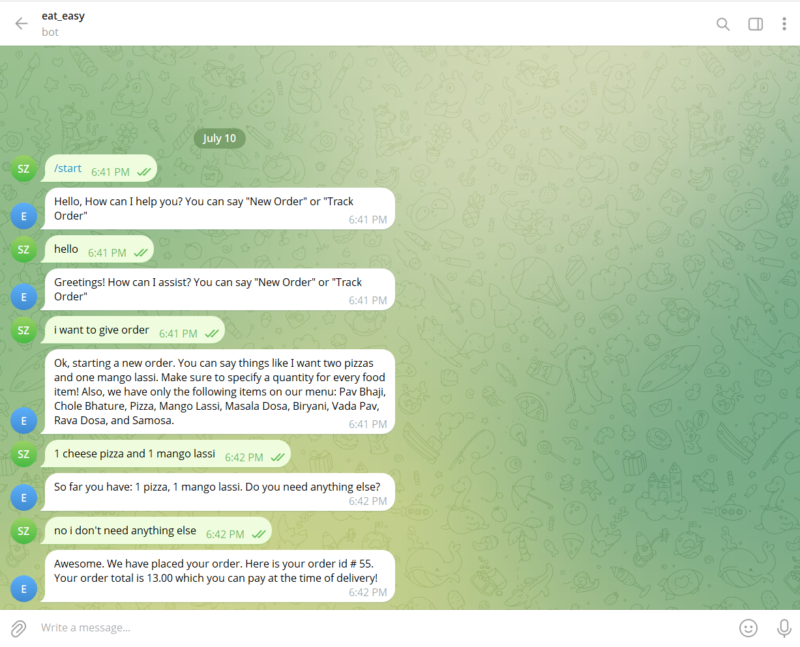
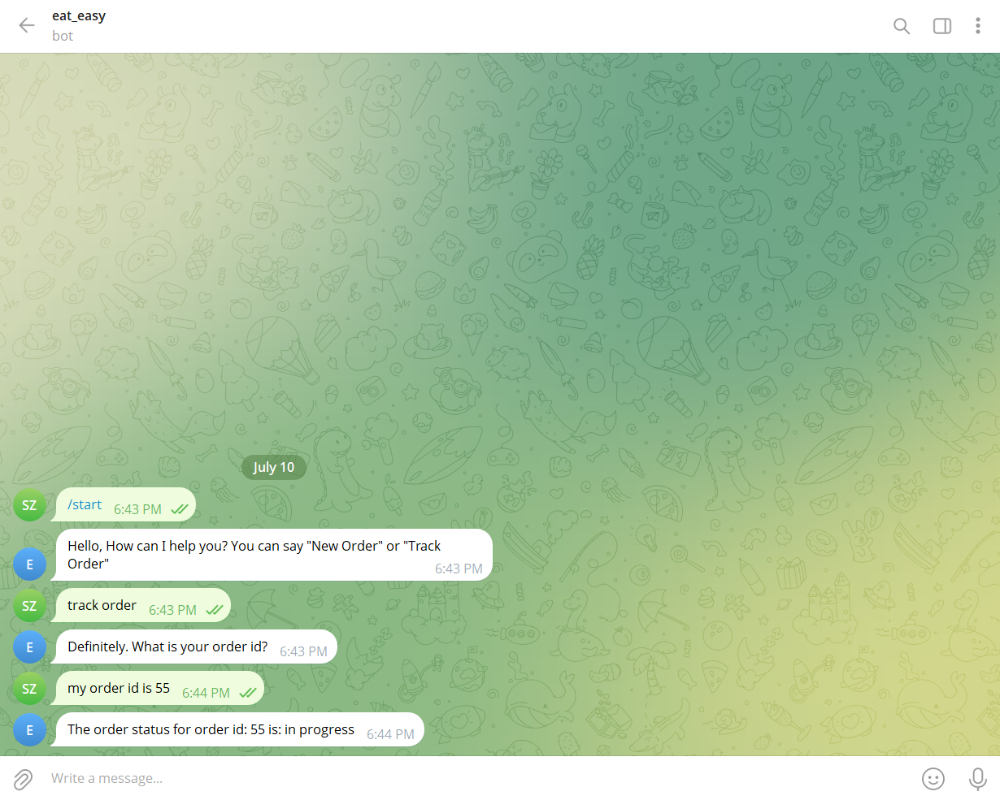
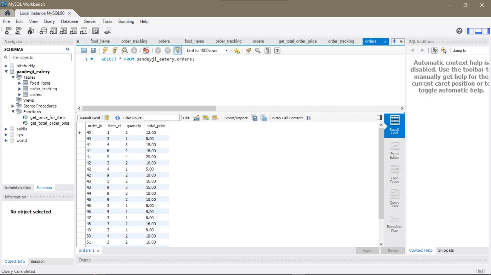

# 🍽️ Food Order Bot

This project is a **Food Ordering Chatbot** built using **Google Dialogflow** for Natural Language Processing (NLP), **FastAPI** for the backend, and **MySQL** as the database. It simulates a conversational food ordering system, capable of taking orders, tracking them, and storing order details persistently.

> ✅ This project showcases my practical experience in building NLP-based conversational agents, API development, and backend integration—ideal for portfolio or interviews.

---

## 🔧 Tech Stack

| Technology | Role |
|-----------|------|
| **Dialogflow (Google NLP)** | Chatbot interface and intent recognition |
| **FastAPI** | Backend API service |
| **MySQL** | Database to store and retrieve order details |
| **Python** | Primary programming language |

---

## 📸 Screenshots

### 🧠 Dialogflow Bot Interface
- This is the Dialogflow console where intents like ordering food, tracking orders, and handling queries are defined.

---

### 🚚 Order Tracking Dialog
- Screenshot showing how the bot interacts with the user for tracking an order using order ID or mobile number.

---

### 🗃️ MySQL Database Schema
- Demonstrates how the backend stores orders in a MySQL table using FastAPI.

---

## 🧠 Features

- 🗣️ **Natural Language Understanding (NLU)** to interpret user intent.
- 📦 **Place food orders** via chatbot interaction.
- 🔍 **Track orders** by ID or customer details.
- 💾 **Store orders persistently** in a MySQL database.
- 🔗 Backend connected via REST API using FastAPI.

---

## 🚀 How It Works

1. **User interacts** with the bot on Dialogflow.
2. The bot **detects intent** and sends data to the backend.
3. **FastAPI** receives the request, processes it, and communicates with **MySQL** to store or retrieve order data.
4. The bot **responds** based on the database output.
